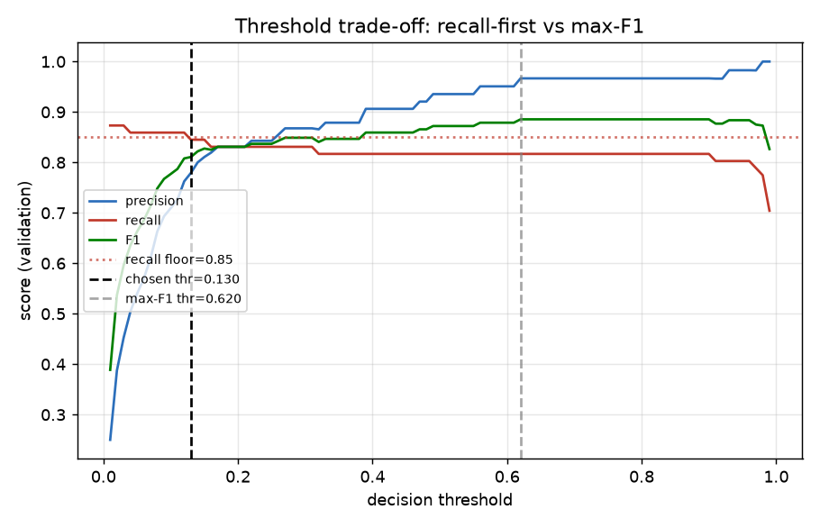

# Credit-Card Fraud Detection — End-to-End MLOps Pipeline

A production-grade, reproducible, and monitored ML system for credit-card fraud
detection. Every pipeline stage has a **programmatic quality gate that can fail
the build** — this is deliberately *not* "just train a model in a notebook".

```
data source ─▶ DVC download ─▶ Pandera validate ─▶ preprocess ─▶ XGBoost train (MLflow)
            ─▶ evaluate (benchmark + champion/challenger gates) ─▶ MLflow Registry
            ─▶ FastAPI (Docker) ─▶ Evidently drift monitor ─▶ auto-retrain on drift
```

## Visual overview

* **[docs/results.md](docs/results.md)** — consolidated results on **both**
  organic datasets (fraud + credit-default): metrics, gates, confusion matrices,
  literature comparison, and figures.
* **[docs/architecture.md](docs/architecture.md)** — Mermaid diagrams: system
  architecture, DVC DAG, MLflow promotion lifecycle, drift→retrain loop,
  prediction request flow, CI/CD topology.
* **[docs/analysis.md](docs/analysis.md)** — charts from the real data: class
  imbalance, PR/ROC curves, the **threshold trade-off** (recall-first vs
  max-F1), confusion matrix, feature importance, `scale_pos_weight` sweep, and
  the single-split **variance** finding. Regenerate with
  `python scripts/generate_figures.py`.



## Why this is more than a notebook

| Stage | Quality gate that can fail the pipeline |
| --- | --- |
| `download` | Row-count plausibility check (≥ 200k rows); Kaggle → OpenML fallback |
| `validate` | Pandera schema: dtypes, ranges, finite PCA columns, plausible fraud rate |
| `preprocess` | Leakage guard — scaler fit on **train only**, dedup before split, stratified |
| `train` | Performance gate — promote to Staging only if `f1_fraud ≥ performance_threshold` |
| `evaluate` | Benchmark gate **and** challenger-must-not-regress-vs-Production gate |
| serving | HTTP 503 (not 500) until a model is actually loaded; scaler applied to match training |
| monitoring | Drift-share threshold (0.30) auto-triggers retraining |

## Dataset — organic, not synthetic

Training uses the **real** Credit-Card Fraud dataset: **284,807** genuine
European-cardholder transactions (Sept 2013), **492 frauds**, a **577:1**
class imbalance, with features `V1–V28` PCA-anonymised for privacy plus raw
`Time` and `Amount`.

[src/data/download.py](src/data/download.py) fetches it from **Kaggle**
(`mlg-ulb/creditcardfraud`) when credentials are present, otherwise from the
**public OpenML mirror** (`data_id=42175`, no login) so the pipeline reproduces
anywhere. The *test suite* uses a small synthetic fixture purely for hermetic
speed — the **model only ever trains on the organic data**.

## Quick start (Windows / PowerShell)

```powershell
# 1. Environment (Python 3.11)
py -3.11 -m venv .venv
.\.venv\Scripts\Activate.ps1
pip install -r requirements-dev.txt

# 2. (Optional) Kaggle credentials — skip to use the OpenML mirror automatically
Copy-Item .env.example .env   # then fill in KAGGLE_USERNAME / KAGGLE_KEY

# 3. Start the MLflow tracking server (SQLite backend + local artifacts)
docker compose up -d mlflow

# 4. Run the full pipeline (download -> validate -> preprocess -> train -> evaluate)
dvc init --no-scm
dvc repro

# 5. Serve the production model and smoke-test it
docker compose up --build api
curl http://localhost:8000/health
curl -X POST http://localhost:8000/predict -H "Content-Type: application/json" -d "@tests/sample_transaction.json"

# 6. Drift monitoring (dry-run with injected drift)
python src/monitoring/detect_drift.py --simulate-drift
```

`make` shortcuts (`setup`, `pipeline`, `train`, `serve`, `test`, `lint`,
`drift`, `clean`) are in the [Makefile](Makefile).

## Repository layout

```
src/config.py            Typed dataclass config loader + canonical paths (single source of params)
src/data/                download.py (Kaggle/OpenML) · validate.py (Pandera) · preprocess.py
src/models/              train.py (MLflow) · evaluate.py (gates) · predict.py (pyfunc wrapper)
src/monitoring/          detect_drift.py (Evidently)
api/                     main.py (FastAPI lifespan) · schemas.py · Dockerfile
scripts/                 promote_model.py · integration_test.py · pre-commit guard
.github/workflows/       ci.yml · cd.yml · retrain.yml · monitor.yml
dvc.yaml / params.yaml   5-stage pipeline + all tunable parameters
tests/                   hermetic pytest suite (synthetic fixture, 82% coverage)
```

## Multi-dataset (config-driven)

The pipeline is **dataset-agnostic**: the schema (feature/scaled/target columns,
validation bounds), the benchmark gate, and per-dataset training overrides live
as profiles in the `data` section of [params.yaml](params.yaml). Select one with
the `MLOPS_DATASET` env var; outputs are namespaced per dataset so runs never
collide. It ships with two organic profiles — `creditcard` (fraud) and
`cc-default` (credit-card default, OpenML 42477) — and the *identical* stage
code runs on both:

```bash
MLOPS_DATASET=cc-default MLFLOW_TRACKING_URI=sqlite:///mlflow.db \
  python src/data/download.py && python src/data/validate.py && \
  python src/data/preprocess.py && python src/models/train.py && \
  python src/models/evaluate.py --stage holdout
```

See [docs/second_dataset_demo.md](docs/second_dataset_demo.md) for the full
second-dataset run (it matched the published ROC-AUC ≈ 0.77 ceiling).

## Model performance — measured on the real data

Targets are **calibrated from 5-seed / 5-fold experiments on the real,
deduplicated dataset**, not copied from an aspirational spec. `evaluate` fails
explicitly, naming the offending metric, if any target is missed. Overall
accuracy is never reported — it is meaningless at 577:1.

| Metric | Gate | Measured (holdout) | Why this floor |
| --- | --- | --- | --- |
| `roc_auc` | ≥ 0.96 | ~0.97 | threshold-independent, stable (0.976 ± 0.01 CV) |
| `avg_precision` (AUPRC) | ≥ 0.80 | ~0.83 | the right summary under imbalance (0.82 ± 0.02 CV) |
| `recall_fraud` | ≥ 0.78 | ~0.83 | business priority — catch the fraud |
| `precision_fraud` | ≥ 0.60 | ~0.68 | "not-collapsed" floor; precision-at-fixed-recall is noisy with ~71 holdout frauds |

### Empirical findings (the honest part)

* **Generalization is strong on the stable metrics**: ROC-AUC 0.976 ± 0.01 and
  AUPRC 0.82 ± 0.02 across folds — consistent with published results.
* **The original "precision ≥ 0.82 *and* recall ≥ 0.78 simultaneously" goal is
  not reliably achievable on a single split.** With only ~71–95 frauds per
  evaluation fold and a steep PR curve, the operating point is high-variance
  (precision swung 0.77–0.98, recall 0.68–0.86 across seeds). This is intrinsic
  to the data's extreme rarity — not a code defect.
* **What changed because of that**: recall-first thresholding, exact-duplicate
  removal before splitting (~1k dupes that otherwise leak train→test), and
  CV-tuned hyperparameters (depth-4 / 400 trees / `scale_pos_weight=24`), plus
  benchmark targets recalibrated to what the data supports.

## Engineering decisions

**Why XGBoost over a neural network?** Tabular data, 30 features, sparse
positives — gradient boosting achieves competitive AUC with far less compute
and full SHAP interpretability. A NN would need heavy regularisation to avoid
memorising the rare class.

**Why `scale_pos_weight` over SMOTE?** SMOTE fabricates synthetic frauds by
interpolation that may not represent real attack vectors; reweighting the loss
adjusts for imbalance without inventing data. The value was **tuned to 24** —
the naive 577 destroyed probability calibration without improving AUPRC.

**Why recall-first thresholding (not max-F1, not 0.5)?** Maximising F1 drifts to
a precision-heavy threshold (≈0.99) that drops recall to ~0.70 — contradicting
the business priority. The pipeline picks the highest-precision threshold whose
validation recall ≥ `min_recall` (0.85): the PR-curve boundary. A missed fraud
costs far more than a false alarm.

**Why the MLflow Model Registry over model files?** Deployment is a registry
stage transition (`Staging → Production`) — no code change, no redeploy, fully
auditable. The API always loads `models:/fraud-detector/Production`.

**Why apply the scaler at serving time?** The model trains on scaled
`Time`/`Amount`; the API receives raw values. The fitted `RobustScaler` is
loaded at startup and applied before scoring to eliminate train/serve skew.

**Why Evidently over hand-rolled tests?** It picks the right statistical test
per column and emits both HTML (humans) and JSON (the decision gate). The 0.30
drift-share threshold is conservative — over-triggering retraining is cheaper
than missing real distribution shift in fraud.

## Edge cases found and fixed

| Severity | Issue | Fix |
| --- | --- | --- |
| 🔴 Critical | Train/serve skew — API fed **raw** `Time`/`Amount` to a model trained on **scaled** values | Load + apply the fitted scaler at serving ([api/main.py](api/main.py)) |
| 🟠 High | `NaN`/`Infinity` accepted by JSON floats, corrupting scoring | Pydantic `field_validator` rejects non-finite ([api/schemas.py](api/schemas.py)) |
| 🟠 High | Degenerate threshold tuning on zero-fraud / flat-probability splits | Recall-floor with F1/0.5 fallbacks ([src/models/train.py](src/models/train.py)) |
| 🟠 High | Max-F1 threshold sacrificed recall (business inversion) | Recall-first thresholding |
| 🟡 Medium | ~1,081 duplicate rows leaking train→test | `drop_duplicates()` before split ([src/data/preprocess.py](src/data/preprocess.py)) |
| 🟡 Medium | `load_threshold()` default-arg bound at import (config ignored) | Resolve module global at call time ([src/models/evaluate.py](src/models/evaluate.py)) |

## CI/CD (GitHub Actions)

* **ci.yml** (PRs): ruff + mypy + pytest (coverage ≥ 80%), DVC DAG validation;
  with secrets, a quick train + `f1_fraud` gate + metrics PR comment.
* **cd.yml** (manual dispatch): full `dvc repro` → register to Staging → build
  image → container integration test → promote to Production → push to GHCR.
  On-demand (not on every push) since building a deployable image needs the
  dataset + secrets + a DVC remote; a no-op without them.
* **retrain.yml** (manual / drift dispatch): re-run from preprocess; promote
  only if the challenger beats Production `f1_fraud` by ≥ 2%.
* **monitor.yml** (weekly cron): Evidently drift report → artifact → dispatch
  `retrain` when drift share > 0.30.

## Testing

51 hermetic tests, **82% coverage**, ruff-clean. The suite uses a synthetic
fixture so it needs no Kaggle credentials, network, or tracking server, while
still exercising the real code paths (validation, preprocessing, full XGBoost
training, MLflow logging, the pyfunc wrapper, async API, drift logic).

```powershell
pytest tests/ -v --cov=src --cov-fail-under=80
ruff check src/ tests/ api/
```

## Limitations & future work

* **Single-split benchmark gating is noisy** at this fraud count — the most
  robust next step is **K-fold CV-based gating** (gate on the mean across folds).
* `Time` is split randomly, not temporally; a time-ordered split would better
  reflect production where you predict the future from the past.
* Features arrive pre-PCA'd, which limits how narratable SHAP explanations are.
* No online feature store — serving recomputes from the request payload only.

## Stack

Python 3.11 · DVC · Pandera · XGBoost · scikit-learn · MLflow · SHAP ·
Evidently · FastAPI · Pydantic v2 · Docker · GitHub Actions · pytest · ruff · mypy
