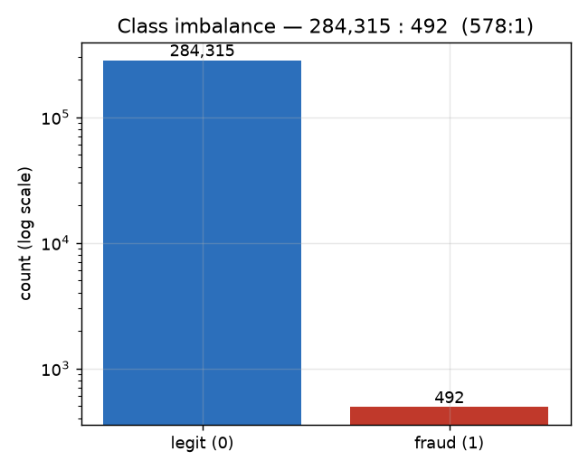
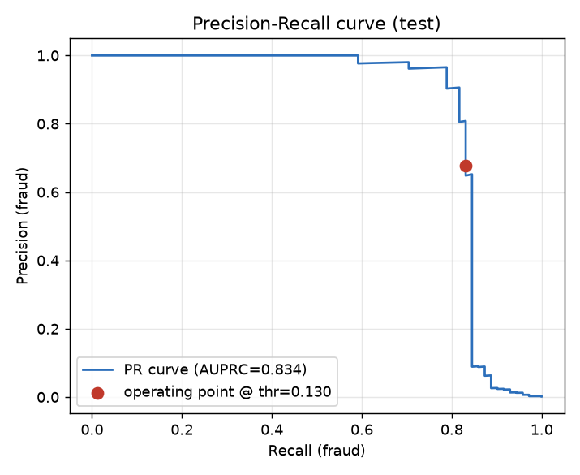
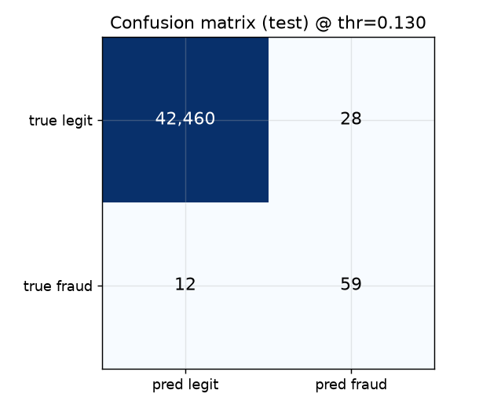
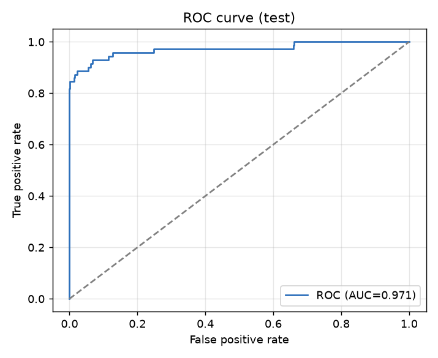
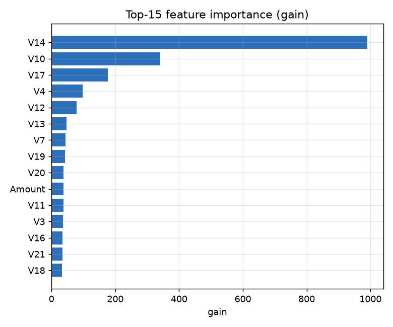
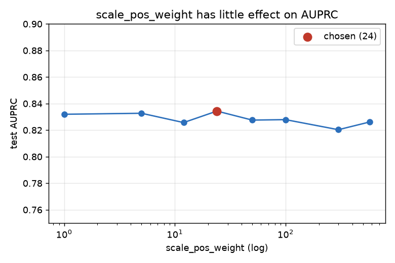
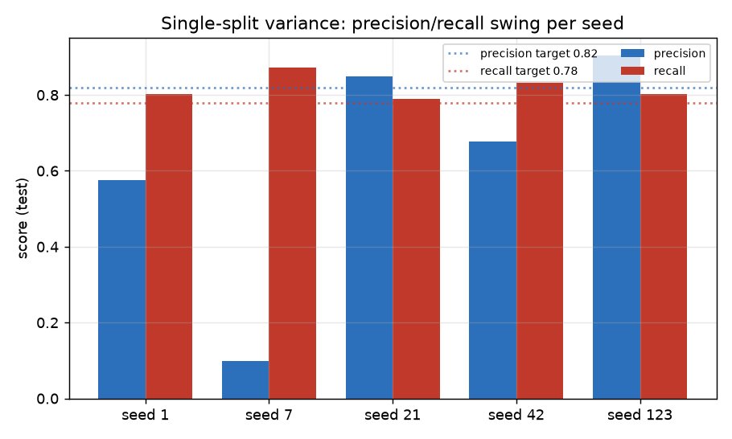
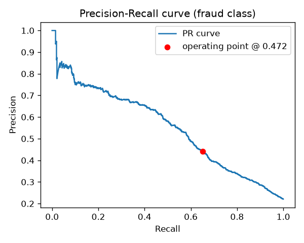
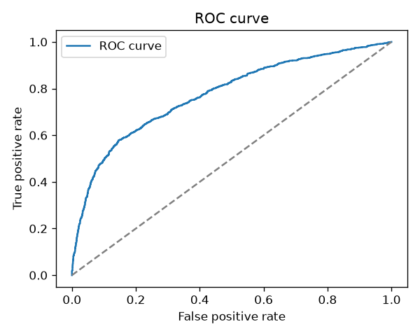
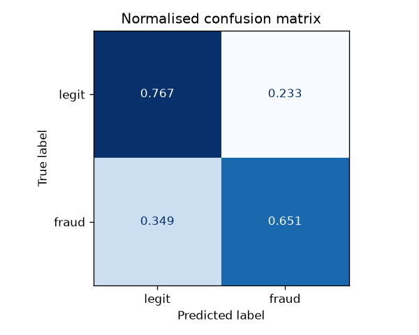

# Results — Both Datasets

Consolidated results from running the **same pipeline** (config-driven) on two
organic datasets. Dataset 1 is the default profile; Dataset 2 was run via
`MLOPS_DATASET=cc-default`. All numbers are measured on the held-out test split.

| | Dataset 1 — `creditcard` (fraud) | Dataset 2 — `cc-default` (default) |
| --- | --- | --- |
| Source | Kaggle `mlg-ulb/creditcardfraud` / OpenML 42175 | OpenML 42477 (Yeh & Lien 2009) |
| Rows (raw → deduped) | 284,807 → 283,726 | 30,000 → 29,965 |
| Features | 30 (`Time`, `Amount`, `V1..V28`, PCA) | 23 (`x1..x23`) |
| Positives | 492 | 6,636 |
| Imbalance | **578 : 1** (0.17%) | **3.5 : 1** (22.1%) |
| Task | detect fraudulent transactions | predict next-month default |

## Configuration used (per dataset)

| Hyperparameter | `creditcard` | `cc-default` |
| --- | --- | --- |
| n_estimators | 400 | 400 |
| max_depth | 4 | 4 |
| learning_rate | 0.05 | 0.05 |
| `scale_pos_weight` | 24 (tuned) | **3.52 (auto from data)** |
| `min_recall` (threshold floor) | 0.85 | 0.65 |
| chosen decision threshold | **0.130** | **0.472** |

Same code; only the `params.yaml` profile differs. The imbalance weight for
`cc-default` was computed automatically (`scale_pos_weight: auto`).

## Holdout metrics

| Metric | `creditcard` | `cc-default` |
| --- | --- | --- |
| ROC-AUC | **0.971** | **0.772** |
| Average precision (AUPRC) | **0.834** | **0.552** |
| Recall (positive) | 0.831 | 0.642 |
| Precision (positive) | 0.678 | 0.434 |
| F1 (positive) | 0.747 | 0.518 |
| Test positives (support) | 71 | 995 |

Confusion matrices (test set):

| | TN | FP | FN | TP |
| --- | --- | --- | --- | --- |
| `creditcard` (n=42,559) | 42,460 | 28 | 12 | **59 / 71 frauds caught** |
| `cc-default` (n=4,495) | 2,665 | 835 | 356 | **639 / 995 defaults caught** |

## Benchmark gate (per-dataset, from `params.yaml`)

Both datasets **passed their own gate** (`evaluate --stage holdout` exited 0):

| Metric | `creditcard` target / actual | `cc-default` target / actual |
| --- | --- | --- |
| roc_auc | ≥ 0.96 / 0.971 ✅ | ≥ 0.74 / 0.772 ✅ |
| avg_precision | ≥ 0.80 / 0.834 ✅ | ≥ 0.50 / 0.552 ✅ |
| recall | ≥ 0.78 / 0.831 ✅ | ≥ 0.55 / 0.642 ✅ |
| precision | ≥ 0.60 / 0.678 ✅ | ≥ 0.30 / 0.434 ✅ |

## Vs published literature (sanity check)

The threshold-independent metrics (ROC-AUC, AUPRC) are the fair comparison and
both land on each dataset's established ceiling:

| | Our ROC-AUC / AUPRC | Published (GBM) |
| --- | --- | --- |
| `creditcard` | 0.971 / 0.834 | ~0.97–0.98 / ~0.85 |
| `cc-default` | 0.772 / 0.552 | ~0.77–0.78 / ~0.54–0.56 |

## Stability (`creditcard`, 5-fold / 5-seed)

ROC-AUC **0.976 ± 0.01**, AUPRC **0.82 ± 0.02** (stable). The precision/recall
*operating point* is high-variance at 578:1 (≈71 holdout frauds), which is why
the gate uses the stable metrics plus a recall floor. `cc-default`, being far
more balanced (22%), has a smooth PR curve and a much steadier operating point.

## How to read the gap

`cc-default` scores lower **because default prediction is a harder, lower-signal
problem than fraud** — not because the pipeline underperforms. Each dataset is
gated on its own realistic, literature-anchored bar, and both pass. Accuracy is
deliberately not used (meaningless at imbalance); for `cc-default` the
recall-first threshold trades headline accuracy (~0.74) to catch 64% of
defaulters, exactly as on the fraud data.

## Figures

**Dataset 1 — fraud** (`docs/images/`):

| | |
| --- | --- |
|  |  |
|  |  |
|  |  |
|  |  |

**Dataset 2 — default** (`docs/images/cc-default/`, pulled from the MLflow run):

| | |
| --- | --- |
|  |  |
|  |  |

## Reproduce

```bash
# Dataset 1 (default profile)
dvc repro

# Dataset 2
MLOPS_DATASET=cc-default MLFLOW_TRACKING_URI=sqlite:///mlflow.db \
  python src/data/download.py && python src/data/validate.py && \
  python src/data/preprocess.py && python src/models/train.py && \
  python src/models/evaluate.py --stage holdout
```

See [second_dataset_demo.md](second_dataset_demo.md) for the per-stage dataset-2
walkthrough and [analysis.md](analysis.md) for the dataset-1 chart commentary.
